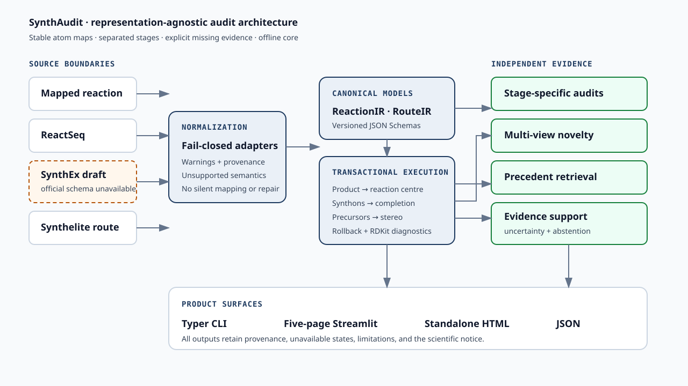

# SynthAudit

**A representation-agnostic audit layer for reaction-edit retrosynthesis**

> **Scientific boundary:** SynthAudit estimates representation validity, corpus novelty and evidence-based plausibility. It does not establish experimental feasibility, yield, selectivity, safety or scalability.

SynthAudit normalizes mapped reactions and reaction-edit languages into a stable `ReactionIR`, executes edits in explicit reaction-centre and synthon-completion stages, and reports structural consistency, corpus novelty, precedent support, evidence-based plausibility, and uncertainty as separate results.

## Why this exists

ReactSeq, agent-authored graph edits, mapped reaction SMILES, and route-planner exports encode overlapping chemistry with different identifiers and failure modes. SynthAudit provides an independent, deterministic layer for asking whether they mean the same graph transformation and where a proposal requires expert review.

The central pipeline is:

```text
external representation -> ReactionIRV1 -> staged transactional execution
                        -> centre/completion/stereo/structural audits
                        -> novelty + precedent + calibrated evidence
```

Novelty is not treated as the inverse of plausibility.

## Install

The reference environment uses Python 3.11 and [uv](https://docs.astral.sh/uv/):

```bash
make install
make quality
make test
make smoke
```

Core tests are offline and do not require model downloads, paid APIs, or large datasets.

## Quick start

```bash
make product-examples
uv run synthaudit version --json
uv run synthaudit execute-reaction --input examples/reaction-ir.json --json /tmp/execution.json
uv run synthaudit audit-reaction --input examples/reaction-ir.json \
  --html /tmp/reaction-audit.html --json /tmp/reaction-audit.json
uv run synthaudit audit-route --input examples/route-ir.json \
  --html /tmp/route-audit.html --json /tmp/route-audit.json
```

Launch the five-page local workspace with `make ui`, or verify it without starting a server with
`make ui-smoke`. Optional integrations are explicit extras and providers; no model or corpus is
downloaded at import time.

## Run common workflows

| Task | Command |
|---|---|
| Parse the pinned ReactSeq subset | `synthaudit parse-reactseq --input example.reactseq --product product.smi --json reaction-ir.json` |
| Normalize mapped reaction SMILES | `synthaudit normalize-reaction --input reaction.smi --representation mapped_reaction_smiles --json reaction-ir.json` |
| Compare representations semantically | `synthaudit compare-representations --reactseq example.reactseq --reactionjson reaction-ir.json --product product.smi --json comparison.json` |
| Search a local precedent index | `synthaudit precedent search --input reaction-ir.json --index index.json --json precedents.json` |
| Score separate novelty views | `synthaudit novelty score --input reaction-ir.json --index index.json --json novelty.json` |
| Generate an offline report | `synthaudit report --reaction reaction-ir.json --output report.html --json report-result.json` |

Every product command returns non-zero on execution/validation failure. Remote data transfer is
disabled unless the user invokes `data download` with an explicit checksum-pinned manifest and
`--allow-network`. Loading a local pickle model also requires `--trust-model-artifact` after its
SHA-256 descriptor is reviewed.

## Inspect the architecture



The editable audit pipeline is in
[`docs/diagrams/audit-pipeline.mmd`](docs/diagrams/audit-pipeline.mmd). Core algorithms live under
`src/synthaudit`; Streamlit files only collect inputs and present package results.

## Scientific and interoperability status

Start with:

- [Project specification](docs/PROJECT_SPEC.md)
- [Scientific claims](docs/SCIENTIFIC_CLAIMS.md)
- [Exact upstream status](docs/UPSTREAM_STATUS.md)
- [Current implementation status](docs/CURRENT_STATUS.md)
- [Known limitations](docs/KNOWN_LIMITATIONS.md)
- [CLI, UI, reports, and reproducible demos](docs/PRODUCT_GUIDE.md)

At the 2026-08-31 pinned upstream revision, SynthEx has not released official ReactionJSON or RouteJSON schemas. SynthAudit therefore exposes a clearly named paper-draft adapter and makes no official-compatibility claim. ReactSeq's official converter is handled through an optional legacy-runtime boundary.

## License

SynthAudit is licensed under Apache-2.0. External code, checkpoints, and datasets retain their own terms and are not vendored by default.
