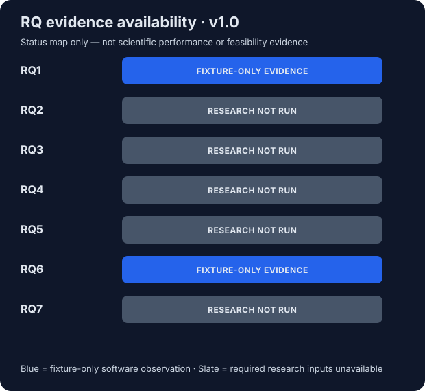
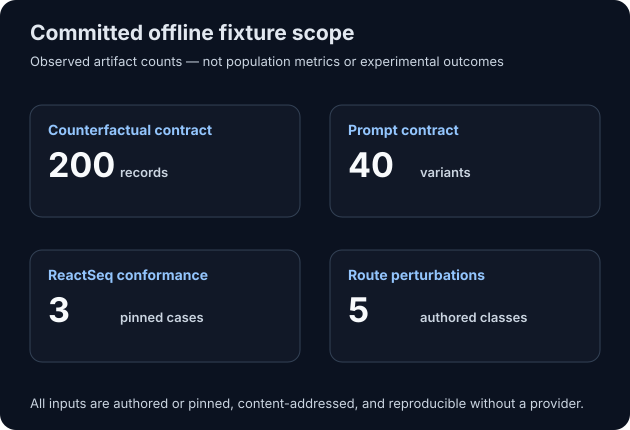

# SynthAudit v1.0 technical report

> SynthAudit estimates representation validity, corpus novelty and evidence-based plausibility. It does not establish experimental feasibility, yield, selectivity, safety or scalability.

## Abstract

SynthAudit v1.0 is a representation-agnostic audit layer for reaction-edit retrosynthesis. It
normalizes explicitly declared mapped representations into a canonical `ReactionIRV1`, executes
the retrosynthetic direction `mapped product -> mapped precursor set` transactionally, and keeps
reaction-centre, completion, stereo, novelty, precedent, and calibrated evidence questions
separate. This report describes the released software, its reproducible offline evidence, and the
status of seven preregistered research questions.

The release evaluation ran every experiment currently justified by the committed artifacts. It
validated authored software fixtures and pinned ReactSeq demo cases, but it did not run a licensed
population study, select a research model, invoke a prompt-capable provider, load ReactSeq_MEO, or
compare official SynthEx outputs. Consequently, RQ1 and RQ6 have limited fixture-only evidence;
RQ2-RQ5 and RQ7 remain `not_run`. Population metrics and bootstrap confidence intervals are not
pre-filled.

## System under evaluation

The canonical processing path is:

```text
declared mapped representation
  -> provenance-preserving adapter
  -> ReactionIRV1 / RouteIRV1
  -> transactional centre, completion, and stereo execution
  -> separate structural, centre, completion, and stereo audits
  -> optional local novelty, precedent, evidence, and route-context layers
  -> CLI, five-page Streamlit workspace, and standalone HTML/JSON reports
```

Atom-map numbers identify atoms; token positions never substitute for maps. Unmapped reactions,
invalid structures, unavailable schemas, missing providers, and untrusted serialized models fail
closed. Raw strings are not used as chemical equality keys. The schema exposes no route success
probability.

## Evaluation design and evidence boundary

The deterministic evaluator is implemented in `synthaudit.evaluation.release` and generated by
`make release-evaluation`. Its versioned
[manifest](../reports/research-evaluation-v1/manifest.json) contains source hashes, nested contract
results, RQ1-RQ7 availability, every required metric, provenance, and the scientific notice.

The observed evidence consists of:

| Artifact | Observed scope | Interpretation |
|---|---:|---|
| Counterfactual fixture | 200 records; 29 designed mutation methods | Schema, generation, split, and review-sheet plumbing only; counts are not error prevalence |
| Prompt fixture | 8 cases; 40 authored variants | Generation/storage contract only; no model was invoked |
| ReactSeq conformance | 3 pinned demo cases | Small regression observation, not a population benchmark; no stereo case |
| Traversal invariance | 1 authored alternate-traversal pair | Semantic-hash invariance example, not an estimated rate |
| Route contract | 18 named checks; 5 authored perturbation classes | Detection plumbing, not route feasibility or population performance |
| Evidence-model contract | 4 stage contracts | Authored numeric software path; no selected model or reportable metric |

All derived counterfactuals stay grouped with their parent. Any future interval or uncertainty
estimate must bootstrap by parent reaction or route ID, never by treating descendants as
independent observations. No confidence interval is reported for the tiny software fixtures.





## Research-question results

| Question | Release status | Evidence or blocker |
|---|---|---|
| RQ1 | Fixture-only evidence | One authored alternate-traversal pair produced equal ReactionIR semantic hashes; all three pinned demo cases parsed, executed, and exactly reconstructed |
| RQ2 | Not run | Designed counterfactual category counts cannot estimate real error prevalence; representative reactions and adjudicated stage-error labels are absent |
| RQ3 | Not run | No licensed, checksum-pinned ReactSeq checkpoint and reproduced MEO extraction environment are configured |
| RQ4 | Not run | No licensed recorded-reaction test set, adjudicated evidence-support labels, or selected calibrated model exists |
| RQ5 | Not run | The 40 prompt variants contain no output from a versioned prompt-capable provider |
| RQ6 | Fixture-only evidence | The route contract detected all five authored dependency/order/condition/continuity perturbation classes |
| RQ7 | Not run | Official SynthEx ReactionJSON/RouteJSON and licensed comparable cross-system outputs are unavailable |

### RQ1 — traversal-aware ReactSeq normalization

The release runner parses two ReactSeq strings that traverse the same mapped product in opposite
orders. Both resolve traversal positions through RDKit atoms to stable atom maps and produce the
same ReactionIR semantic hash. Separately, the three pinned upstream demo fixtures have observed
parse, execution, and exact precursor reconstruction counts of 3/3 each. Their mean fixture-case
reaction-centre precision, recall, and F1 are each 1.0, and leaving-group exact match is 3/3.

These are deliberately narrow regression observations. One traversal pair and three demos do not
establish a distribution-level normalization rate, do not cover symmetric ambiguity broadly, and
contain no evaluable stereo-retention target. RQ1 therefore remains only partially supported.

### RQ2 — stage distribution of errors

No prevalence estimate is reported. The 200-record counterfactual fixture contains designed
representation, reaction-centre, completion, stereo, and route mutations. Its category counts
reflect generator construction choices, not the natural incidence of errors in model outputs or
recorded chemistry. Answering RQ2 requires a representative, versioned sample, a frozen annotation
protocol, reviewer agreement, and parent-group bootstrap.

### RQ3 — complementarity of ReactSeq_MEO novelty

This experiment was not run. The pinned ReactSeq source exposes embedding extraction code but no
checkpoint in the inspected Git tree. An externally referenced artifact has not been licensed,
checksum-pinned, or reproduced locally. SynthAudit therefore returns MEO evidence as unavailable
and does not substitute another fingerprint under that name.

### RQ4 — novelty/plausibility separation and false rejection

The software enforces the required separation: corpus familiarity is excluded from primary
plausibility-model features, novelty is reported independently, and `plausibility = 1 - novelty`
is prohibited. Whether this design reduces high-novelty false rejection is still an empirical
question. No high-novelty false-rejection value is reported without a licensed held-out set,
adjudicated support labels, and a selected calibrated evidence model.

### RQ5 — prompt robustness

The committed benchmark contains eight cases and forty deterministic variants: exact, partial,
ambiguous, incorrect-but-structurally-plausible, and contradictory. No ReactSeq, SynthEx, LLM, or
other prompt-capable provider was invoked. Therefore prompt obedience, recovery, precursor
accuracy, confidence degradation, reliability, and provider comparisons remain `not_run`.

### RQ6 — route-only failure detection

The software fixture exercises dependency-violating step order, early deprotection, late
protection, fragile-intermediate condition conflict, and an unproduced precursor. The route
contract detected all five authored classes while exposing per-step audits and 18 named
route-context checks. This demonstrates that the implementation has route-level observables not
present in an isolated single-step result. It does not estimate recall on real routes, validate
the protecting-group rules as comprehensive chemistry, or establish route success.

### RQ7 — cross-system comparison

This comparison remains `not_run`. SynthEx has not published a verified official
ReactionJSON/RouteJSON specification at the pinned commit. Synthelite support targets one inspected
implementation export with explicit mapping, and no comparable corpus-trained ReactSeq outputs
are bundled. A future study must freeze mapping, sampling, licenses, versions, and output schemas
before comparing template recognition, novelty, rings, precedents, structural failures,
completion uncertainty, or stereo uncertainty.

## Required metric status

The complete machine-readable table is
[`required-metric-status.csv`](../reports/research-evaluation-v1/tables/required-metric-status.csv).
Only six values are emitted, all scoped to three pinned software fixtures:

| Metric | Fixture observation | Research status |
|---|---:|---|
| Parse success | 3/3 | Not a population estimate |
| Exact precursor reconstruction | 3/3 | Not a population estimate |
| Reaction-centre precision | Mean 1.0 across 3 cases | Not a population estimate |
| Reaction-centre recall | Mean 1.0 across 3 cases | Not a population estimate |
| Reaction-centre F1 | Mean 1.0 across 3 cases | Not a population estimate |
| Leaving-group exact match | 3/3 | Not a population estimate |

Completion accuracy and stereo retention are `not_run` because their required targets are absent.
AUROC, AUPRC, Brier score, Expected Calibration Error, false rejection, false acceptance,
selective risk, coverage, and high-novelty false rejection are `not_run` because there is no
licensed adjudicated research set or selected calibrated model. Blank cells in the CSV are
intentional missing results, not zeroes.

## Threats to validity

- The authored fixtures optimize contract coverage, not representativeness.
- Three ReactSeq demos are too few for population inference and contain no stereo case.
- Reference representations may be incomplete or wrong; agreement is not experimental truth.
- RDKit version, mapping, aromaticity, tautomer/protonation, and symmetry choices affect results.
- Route protection and condition checks depend on declared metadata and transparent heuristics.
- No prospective, laboratory, large-corpus, paid-provider, GPU, or multi-centre validation ran.
- Missing official SynthEx schemas prevent an official cross-system compatibility claim.

## Reproduction

```bash
make install
make schemas
make release-evaluation
make reproduce-small
```

`make release-evaluation` regenerates the manifest, three CSV tables, two accessible SVG figures,
README, and `SHA256SUMS`. Regression tests require byte-for-byte equality. The canonical full
environment is Docker plus `uv.lock`; unit and release-fixture tests do not access the network.

| Evidence | Finding | Reproduction path |
|---|---|---|
| Release manifest and SHA256SUMS | Inputs and generated evaluation artifacts are content-addressed | `make release-evaluation` |
| ReactSeq golden fixture and traversal pair | Narrow fixture-only semantic and reconstruction observations | `make reactseq-conformance-small release-evaluation` |
| Route/prompt smoke contract | Five authored route perturbation classes are detected; prompt metrics are absent | `make route-prompt-small` |
| Full verification suite | Schema, execution, audit, product, report, and release invariants | `make reproduce-small` |

## Conclusion

SynthAudit v1.0 releases a reproducible audit architecture and a truthful research-evaluation
boundary. It shows that the implemented contracts can preserve mapped identity, execute staged
edits, distinguish evidence layers, detect authored route failures, and expose unavailable
research inputs. It does not claim that the unrun scientific questions have been answered. The
next research step is a separately licensed, preregistered, parent-grouped study with adjudicated
labels and versioned model/provider artifacts.
